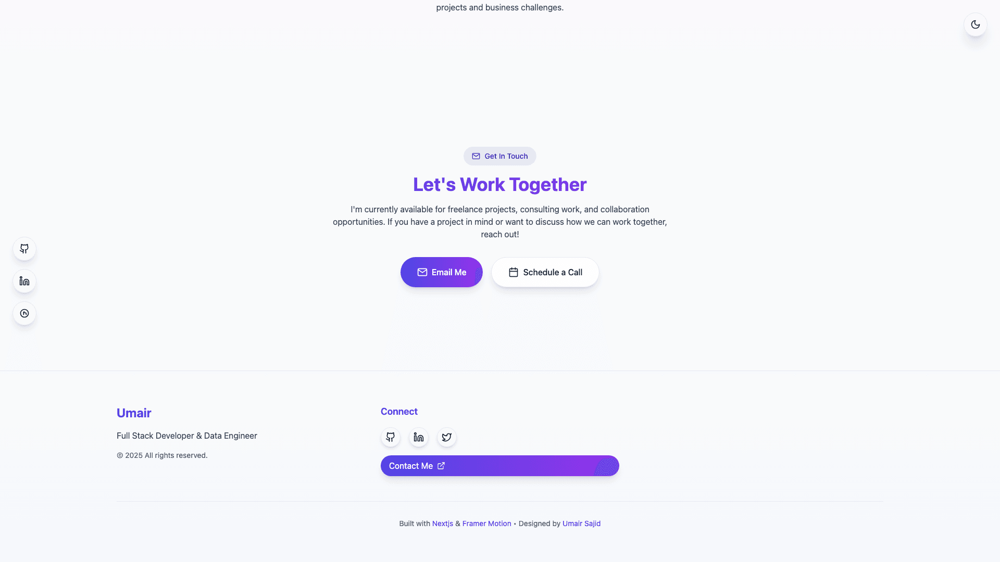

# Umair Sajid - Portfolio Website

A modern, interactive portfolio website showcasing full-stack development and data engineering expertise. Built with React, TypeScript, and Tailwind CSS, featuring dynamic animations, code visualizations, and data pipeline demonstrations.

## 📸 Screenshots

<div align="center">

### Hero Section
| Light Mode | Dark Mode |
|------------|-----------|
|  |  |

### Interactive Code Animation

*Live code editor with syntax highlighting and drag-and-drop functionality*

### Data Pipeline Visualization

*Interactive D3.js flowchart showing data engineering workflows*

### Responsive Device Showcase

*Cross-platform data dashboard demonstration*

### Contact & Scheduling

*Built-in appointment scheduling and contact integration*

</div>

## 🚀 Features

### Interactive Components
- **Dynamic Code Animation**: Live code editor with syntax highlighting for Python, JavaScript, and SQL
- **Data Pipeline Visualization**: Interactive flowchart showing data engineering workflows with D3.js
- **Device Showcase**: Responsive design demonstrations across different device frames
- **Project Modal System**: Detailed project views with routing support
- **Theme System**: Dark/light mode with system preference detection
- **Schedule Call Integration**: Built-in appointment scheduling functionality

### Technical Highlights
- **Modern React Architecture**: Hooks, Context API, and TypeScript for type safety
- **Framer Motion Animations**: Smooth transitions and interactive elements
- **Supabase Integration**: Real-time data management for portfolio content
- **Responsive Design**: Mobile-first approach with Tailwind CSS
- **Code Mirror Integration**: Live code editing with multiple language support
- **Sound Effects**: Optional audio feedback for interactions

## 🛠️ Tech Stack

### Frontend
- **React 18** - Modern React with hooks and concurrent features
- **TypeScript** - Type-safe development
- **Vite** - Fast build tool and development server
- **Tailwind CSS** - Utility-first CSS framework
- **Framer Motion** - Animation library for React

### UI & Interactions
- **Lucide React** - Beautiful icon library
- **CodeMirror** - Code editor with syntax highlighting
- **D3.js** - Data visualization for pipeline diagrams
- **Three.js** - 3D graphics and animations
- **React Router** - Client-side routing

### Backend & Data
- **Supabase** - Backend-as-a-Service for data management
- **PostgreSQL** - Relational database (via Supabase)

### Development Tools
- **ESLint** - Code linting and formatting
- **PostCSS** - CSS processing
- **Autoprefixer** - CSS vendor prefixing

## 📁 Project Structure

```
src/
├── components/           # Reusable UI components
│   ├── BackgroundAnimation.tsx
│   ├── CodeAnimation.tsx
│   ├── DataPipelineAnimation.tsx
│   ├── DeviceShowcase.tsx
│   ├── ProjectCard.tsx
│   ├── ProjectModal.tsx
│   ├── ScheduleCall/
│   └── ...
├── context/             # React context providers
│   └── ThemeContext.tsx
├── hooks/               # Custom React hooks
│   └── usePortfolioData.ts
├── lib/                 # Utility libraries
│   └── supabase.ts
├── pages/               # Page components
│   └── PortfolioPage.tsx
├── App.tsx              # Main application component
├── main.tsx             # Application entry point
└── index.css            # Global styles
```

## 🚀 Getting Started

### Prerequisites
- Node.js 18+ 
- npm or yarn
- Supabase account (for data management)

### Installation

1. **Clone the repository**
   ```bash
   git clone https://github.com/BinaryNavigator07/umair
   cd umair
   ```

2. **Install dependencies**
   ```bash
   npm install
   ```

3. **Environment Setup**
   ```bash
   cp .env.example .env
   ```
   
   Update `.env` with your Supabase credentials:
   ```env
   VITE_SUPABASE_URL=your-supabase-url
   VITE_SUPABASE_ANON_KEY=your-supabase-anon-key
   ```

4. **Database Setup**
   
   Create the following tables in your Supabase database:
   
   ```sql
   -- Profile table
   CREATE TABLE profile (
     id SERIAL PRIMARY KEY,
     name TEXT NOT NULL,
     title TEXT NOT NULL,
     tagline TEXT,
     about TEXT,
     skills TEXT[], -- Array of skills
     email TEXT,
     github TEXT,
     linkedin TEXT,
     upwork TEXT
   );
   
   -- Projects table
   CREATE TABLE projects (
     id SERIAL PRIMARY KEY,
     title TEXT NOT NULL,
     description TEXT,
     long_description TEXT,
     image TEXT,
     technologies TEXT[], -- JSON array
     features TEXT[], -- JSON array
     category TEXT,
     link TEXT,
     github TEXT,
     featured BOOLEAN DEFAULT false,
     related_projects TEXT[], -- JSON array of project IDs
     sort_order INTEGER DEFAULT 0
   );
   
   -- Experience table
   CREATE TABLE experience (
     id SERIAL PRIMARY KEY,
     year TEXT NOT NULL,
     title TEXT NOT NULL,
     company TEXT NOT NULL,
     description TEXT,
     skills TEXT[], -- JSON array
     icon TEXT,
     sort_order INTEGER DEFAULT 0
   );
   
   -- Testimonials table
   CREATE TABLE testimonials (
     id SERIAL PRIMARY KEY,
     name TEXT NOT NULL,
     role TEXT NOT NULL,
     content TEXT NOT NULL,
     avatar TEXT,
     rating INTEGER DEFAULT 5,
     sort_order INTEGER DEFAULT 0
   );
   ```

5. **Start Development Server**
   ```bash
   npm run dev
   ```

6. **Build for Production**
   ```bash
   npm run build
   ```

## 🎨 Customization

### Theme Configuration
The website supports both light and dark themes. Customize colors in:
- `tailwind.config.js` - Tailwind CSS configuration
- `src/context/ThemeContext.tsx` - Theme logic
- Component-level theme handling

### Content Management
All content is managed through Supabase tables:
- **Profile**: Personal information and skills
- **Projects**: Portfolio projects with detailed information
- **Experience**: Work history and achievements
- **Testimonials**: Client feedback and reviews

### Animation Customization
- **Framer Motion**: Modify animations in component files
- **Code Animation**: Customize code snippets in `CodeAnimation.tsx`
- **Data Pipeline**: Update workflow steps in `DataPipelineAnimation.tsx`

## 🚀 Deployment

### Netlify (Recommended)
1. Connect your repository to Netlify
2. Set build command: `npm run build`
3. Set publish directory: `dist`
4. Add environment variables in Netlify dashboard
5. Deploy automatically on git push

### Vercel
1. Import project to Vercel
2. Configure build settings
3. Add environment variables
4. Deploy

### Manual Deployment
```bash
npm run build
# Upload dist/ folder to your hosting provider
```

## 🔧 Configuration Files

- **`vite.config.ts`** - Vite build configuration
- **`tailwind.config.js`** - Tailwind CSS customization
- **`tsconfig.json`** - TypeScript configuration
- **`netlify.toml`** - Netlify deployment settings
- **`package.json`** - Dependencies and scripts

## 📸 Adding Screenshots

The README includes screenshots that showcase the portfolio's key features. You can generate them automatically or add them manually.

### Automated Screenshot Generation

```bash
# Install dependencies for screenshot generation
npm install playwright sharp

# Start development server
npm run dev

# Generate screenshots (in another terminal)
npm run screenshots

# Optimize images for web
npm run optimize-images

# Or run both commands together
npm run docs:setup
```

### Manual Screenshot Setup

1. **Take screenshots** of each section as described in [`docs/SCREENSHOTS.md`](docs/SCREENSHOTS.md)
2. **Save images** to `docs/screenshots/` with the correct filenames
3. **Optimize images** for web to ensure fast loading
4. **Verify** all images display correctly in the README

For detailed instructions and best practices, see the [Screenshots Setup Guide](docs/SCREENSHOTS.md).

## 📱 Features Breakdown

### Code Animation Component
- Live syntax highlighting for multiple languages
- Drag-and-drop code snippets
- Expandable code editor
- Typing animation effects
- Sound effects integration

### Data Pipeline Visualization
- Interactive D3.js flowchart
- Step-by-step animation
- Hover tooltips with descriptions
- Responsive design
- Theme-aware styling

### Project Management
- Dynamic project loading from Supabase
- Modal-based project details
- Related projects suggestions
- Technology tag filtering
- Featured projects highlighting

## 🤝 Contributing

1. Fork the repository
2. Create a feature branch (`git checkout -b feature/amazing-feature`)
3. Commit your changes (`git commit -m 'Add amazing feature'`)
4. Push to the branch (`git push origin feature/amazing-feature`)
5. Open a Pull Request

## 📄 License

This project is licensed under the MIT License - see the [LICENSE](LICENSE) file for details.

## 🙋‍♂️ Contact

**Umair Sajid**
- Portfolio: [Live Demo](https://your-portfolio-url.com)
- Email: your-email@example.com
- LinkedIn: [Your LinkedIn](https://linkedin.com/in/your-profile)
- GitHub: [Your GitHub](https://github.com/your-username)

## 🙏 Acknowledgments

- [React](https://reactjs.org/) - UI library
- [Framer Motion](https://www.framer.com/motion/) - Animation library
- [Tailwind CSS](https://tailwindcss.com/) - CSS framework
- [Supabase](https://supabase.com/) - Backend services
- [Lucide](https://lucide.dev/) - Icon library
- [CodeMirror](https://codemirror.net/) - Code editor
- [D3.js](https://d3js.org/) - Data visualization

---

⭐ **Star this repository if you found it helpful!**